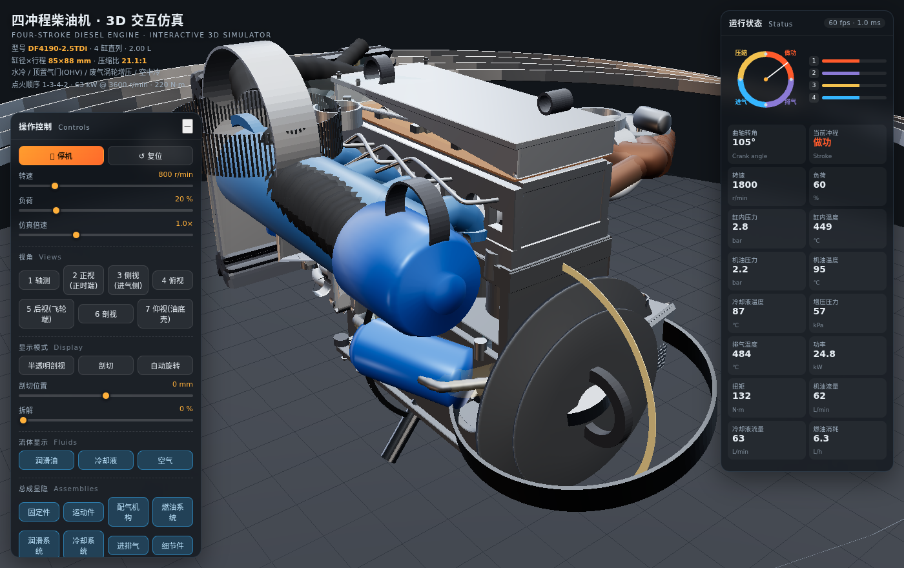
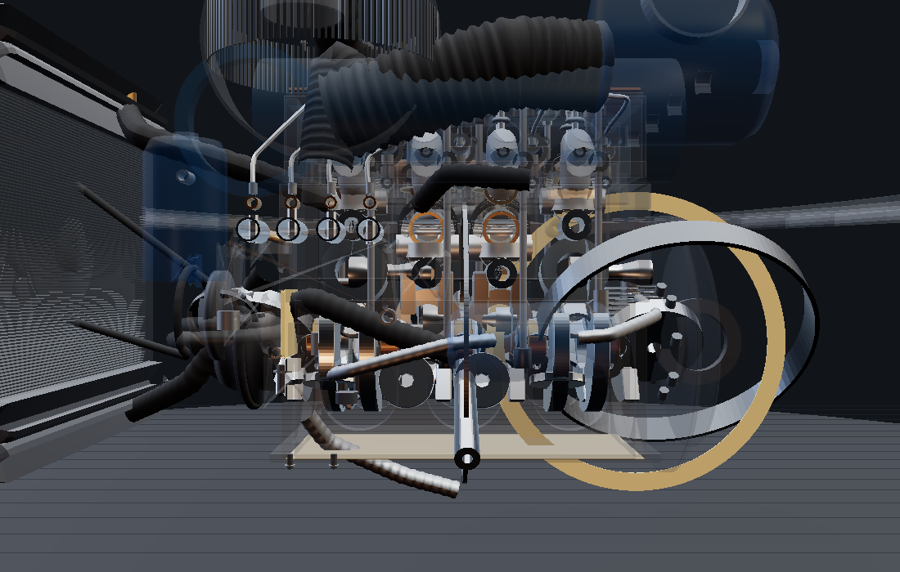
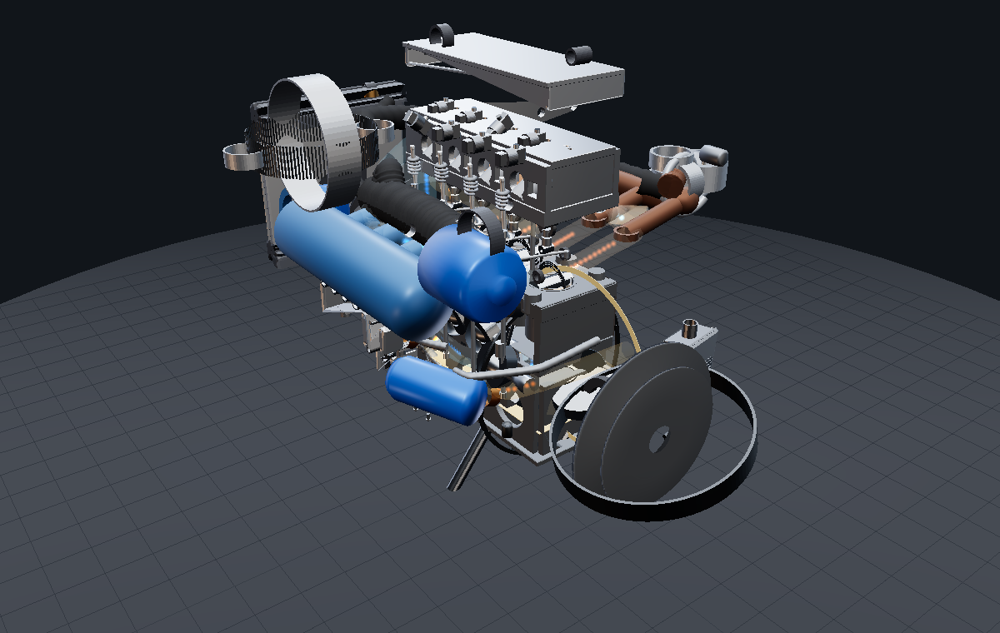

# 四冲程柴油机高精度 3D 交互仿真系统

**在线体验（GitHub Pages）：** ▶ https://bill-666code.github.io/diesel-engine-3d-sim/
点击链接即可直接游玩，无需安装。仓库：https://github.com/Bill-666code/diesel-engine-3d-sim



基于 **Three.js (WebGL2)** 的纯前端四冲程直列四缸涡轮增压柴油机仿真：全尺寸参数化建模、精确的曲柄连杆与配气运动学、
三路流体（机油 / 冷却液 / 空气）流动可视化、PBR 材质、剖视与拆解模式、鼠标悬停零件信息卡。

> 无需构建、无需联网：`vendor/three.module.js` 已随包提供。本地预览需用静态服务器（ES Module 不支持 `file://`）。



---

## 一、快速开始

**方式一：在线** —— 直接打开 <https://bill-666code.github.io/diesel-engine-3d-sim/>

**方式二：本地**

```bash
git clone https://github.com/Bill-666code/diesel-engine-3d-sim.git
cd diesel-engine-3d-sim
python3 -m http.server 8080      # 或 npx serve / php -S localhost:8080
# 浏览器打开 http://localhost:8080/index.html
```

| URL 参数 | 说明 |
| --- | --- |
| `?q=low` | 低画质模式（关闭阴影/抗锯齿/环境贴图，降低粒子密度）——用于老旧核显或低性能设备 |
| `?still=1` | 静帧模式（只渲染 3 帧后暂停循环）——用于自动化截图与性能测量 |
| `?capture=1` | 保留绘制缓冲，便于 `canvas.toDataURL()` 截图 |

嵌入式使用：

```html
<iframe src="https://bill-666code.github.io/diesel-engine-3d-sim/" style="width:100%;height:100%;border:0"></iframe>
```



---

## 二、操作引导

| 操作 | 方式 |
| --- | --- |
| 旋转视角 | 左键拖拽 / 触屏单指拖动 |
| 缩放 | 鼠标滚轮 / 触屏双指捏合 |
| 平移 | 右键拖拽，或 `Shift` + 左键拖拽 |
| **零件查询** | 鼠标悬停在任意零件表面 → 弹出信息卡（名称中英对照、材料/工艺、功能、关键参数、**实时运动状态**） |
| 锁定零件 | 单击零件固定信息卡与高亮框；`Esc` 或单击空白处取消 |
| 视角预设 | 界面按钮或数字键 `1`–`8`（轴测/俯视/侧视进气侧/侧视排气侧/正视正时端/后视飞轮端/剖视/仰视） |
| 半透明剖视 | 按钮或 `G`：外壳/水套/油道半透明，可直接看到内部运动件 |
| 剖切 | 按钮或 `C`：沿 Z 轴切开壳体，拖动"剖切位置"滑块移动切面 |
| 拆解 | 拖动"拆解"滑块：缸盖、缸体、油底壳、正时室、进排气等按爆炸图展开 |
| 运行控制 | 转速 / 负荷 / 仿真倍速滑块；`空格` 启停；"复位"恢复默认 |
| 流体显示 | 三个开关分别控制润滑油、冷却液、空气流线；`F` 键一键切换 |
| 装配显隐 | 8 个总成开关（固定件 / 运动件 / 配气机构 / 燃油 / 润滑 / 冷却 / 进排气 / 细节件） |
| 帮助 | `H` 键随时打开操作引导 |

---

## 三、机型参数（仿真对象）

| 项目 | 数值 |
| --- | --- |
| 型号 | DF4190-2.0TDi（2.0 L 直列四缸涡轮柴油机） |
| 缸径 × 行程 | φ85.0 × 88.0 mm |
| 排量 / 压缩比 | 1997 cm³ / **21.1 : 1**（由燃烧室几何自动计算） |
| 连杆中心距 / 连杆比 | 134.0 mm / 1.523 |
| 配气机构 | SOHC 8V、顶置气门推杆摇臂（凸轮轴位于缸体挺柱室，长推杆） |
| 气门 | 进气 φ42 / 排气 φ34，升程 12.0 mm，摇臂比 1.6 |
| 配气正时 | IVO 12° BTDC / IVC 42° ABDC / EVO 50° BBDC / EVC 14° ATDC |
| 点火顺序 | 1-3-4-2，喷油提前角 8° BTDC |
| 性能 | 63 kW @ 3600 r/min，220 N·m @ 1900 r/min，4200 r/min 最高转速 |

压缩比、余隙容积、缸心距等由 `src/spec.js` 的几何参数**推导**（`computeDerived()`），改尺寸后指标自动同步。

---

## 四、仿真内容

### 1. 结构建模（可拆解级精度，56 个可选零件）
* **固定件**：气缸体、湿式缸套、水套、主轴承座/主油道、气缸盖（含燃烧室、进排气道、气门座与导管）、
  气门室罩、气缸垫、油底壳、集滤器、飞轮壳、正时齿轮室、摇臂轴
* **运动件**：活塞（含顶面燃烧碗与 3 道环槽）、活塞环组、浮式活塞销、连杆（含工字杆身、大头盖、连杆螺栓）、连杆轴瓦、
  曲轴（5 道主轴颈、4 连杆颈、18 片曲柄臂与平衡重、前后法兰）、飞轮（含 132 齿起动齿圈）、曲轴皮带轮/扭转减振器
* **配气机构**：凸轮轴（8 个按正时磨削的凸轮桃）、挺柱、推杆（φ10 长推杆）、摇臂（含调整螺钉）、进气门/排气门、
  气门弹簧（上下半段随运动错动）、气门座、导管、弹簧保持座、正时齿轮组
* **燃油系统**：高压油泵（4 组柱塞偶件 + 出油阀 + 调速器）、喷油器（7 孔喷嘴 + 夹紧座）、高压油管、低压输油管、燃油滤清器
* **润滑系统**：机油泵（内外转子）、机油滤清器、机油冷却器（管板式）、吸油管、主油道及分支、压力传感器、油尺
* **冷却系统**：水泵（蜗壳 + 叶轮）、节温器（含感温阀）、散热器（芯组 + 上下水室 + 压力盖）、风扇与导风罩、皮带、冷却水管路
* **进排气系统**：进气管（稳压腔 + 4 支歧管）、排气管（汇流总管）、涡轮增压器（涡轮壳/中间体/压气机壳/叶轮/执行器）、
  中冷器、空气滤清器、增压空气管路
* **细节件**：16 × 气缸盖螺栓、10 × 主轴承螺栓、连杆螺栓、油底壳/罩盖螺栓、油封组、垫片组

### 2. 运动仿真（精确相位）
* 曲柄滑块方程 `y = r·cosθ + √(l² − r²sin²θ)`，活塞销/连杆/曲轴颈实时联动。
* 四冲程严格按 **吸气 → 压缩 → 做功 → 排气** 推进（曲轴 720° 循环，点火顺序 1-3-4-2）。
* 气门升程按**摆线升程曲线**生成，凸轮桃几何与升程函数同源；挺柱、推杆、摇臂、气门逐级按 1.6 摇臂比运动，
  凸轮轴按 1/2 曲轴转速旋转并按每缸相位偏移（进/排桃间隔 147°）。
* 状态面板实时显示曲轴转角、冲程、缸内压力/温度、机油压力/温度、冷却液温度、增压压力、排气温度、功率/扭矩/油耗。
* 缸内燃气随燃烧进程发光（做功行程可见橙色辉光），喷油器按提前角与负荷脉动。

### 3. 流体可视化
* **润滑油**：集滤器 → 机油泵 → 机油滤清器 → 机油冷却器 → 主油道 → 5 道主轴承 / 缸壁 / 摇臂轴。
* **冷却液**：缸盖出水 → 散热器 → 节温器 → 水泵 → 缸体水套（含节温器小循环旁通，随水温开启度切换）。
* **空气**：空滤 → 稳压腔 → 各缸进气道（随进气门升程增强）→ 排气道 → 涡轮（随排气门升程增强）。
* 粒子沿流线运动，速度与数量随 **转速、负荷、节温器开度、气门升程** 实时变化；粒子 + 半透明流线管双重表达。

### 4. 交互
* 悬停信息卡：名称（中/英）、所属分组、材料、制造工艺、功能、6–8 项关键参数、**当前运动状态**（如"排气门开启中 升程 8.2 mm (68%)"）。
* 状态文案由 `state(EngineState)` 实时计算，与画面同步。

### 5. 视觉
* PBR：金属铸件/锻钢/淬硬件/铜铝轴瓦/橡胶/硅胶/垫片等差异化材质 + 程序化影棚环境贴图（PMREM）。
* 色调映射 ACES Filmic、软阴影、半透明剖视与剖切平面、爆炸拆解。
* 8 种视角预设、图例、状态面板与快捷键。

---

## 五、性能

| 指标 | 数值 |
| --- | --- |
| 可选零件 | 58 个（登记表），实体网格 ≈ 400 k 三角面片（含流体） |
| 渲染调用 | ≈ 670 draw calls（含 3 路流体流线与粒子） |
| 仿真线程单帧耗时 | 实测 **1.0 ~ 1.3 ms**（状态 + 运动学 + 粒子 + 拾取，headless 软件渲染下测得） |
| 目标帧率 | 独立显卡 ≥ 60 fps；集显建议加 `?q=low` |
| 低配模式 | 关闭阴影/抗锯齿、粒子数 35%、像素比 1 |

界面右上角实时显示 `fps · 仿真线程耗时(ms)`，便于实测。

---

## 六、目录结构

```
diesel-sim/
├── index.html          # 界面骨架（状态面板 / 控制面板 / 信息卡 / 引导弹窗）
├── styles.css          # 界面样式
├── vendor/
│   └── three.module.js # Three.js r169（本地内置，离线可用）
├── src/
│   ├── main.js         # 启动、渲染循环、拾取与高亮
│   ├── scene.js        # 渲染器/光照/环境/剖视/拾取装配
│   ├── spec.js         # 机型主参数 + 推导量（压缩比、缸心距、摇臂几何…）
│   ├── kinematics.js   # 曲柄滑块、气门升程曲线、喷油相位、热力学简化模型
│   ├── geometry.js     # 通用几何构件（车削/拉伸/齿轮/凸轮/弹簧/管路/皮带…）
│   ├── materials.js    # PBR 材质库 + 程序化环境贴图 + 剖视/半透明控制
│   ├── registry.js     # 零件登记（几何体 ↔ 元数据 ↔ 拆解位移）
│   ├── controls.js     # 轨道控制器与视角预设
│   ├── fluids.js       # 机油/冷却液/空气流线与粒子
│   ├── ui.js           # 面板、四冲程循环图、图例、信息卡
│   ├── data/parts.js   # 零件信息库（中英 / 材料 / 工艺 / 功能 / 参数 / 状态）
│   └── builders/       # 各系统建模：fixed / head / valvetrain / rotating /
│                       #            fuel / lubrication / cooling / induction / details
└── tools/cdp.mjs       # 无头浏览器自动化（控制台抓取 + 截图 + 表达式执行），仅用于开发自检
```

## 七、已知取舍

* 为保证浏览器端 60 fps，运动学与压力模型采用解析式（摆线升程 + 多项式燃烧放热 + 多项态膨胀），
  显示的压力/温度/功率为**模拟值**，用于工况趋势展示，不作为标定数据。
* 螺栓、密封圈、垫片等按要求做示意级建模（外形与位置正确，不含螺纹细节）。
* 流体为可视化示意（粒子 + 半透明流线），非 CFD 计算。
